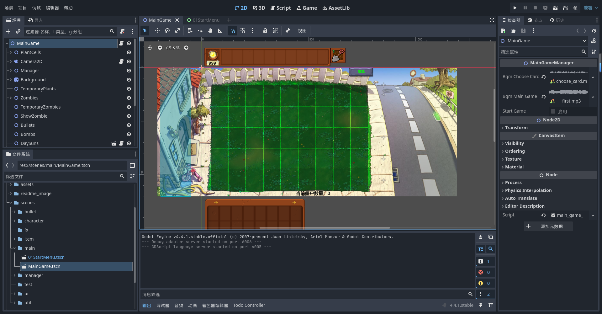
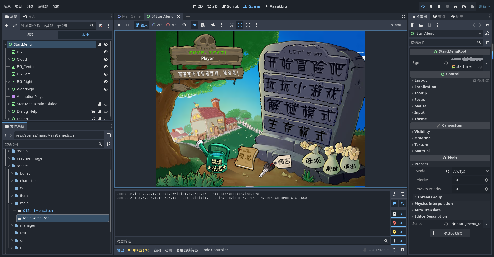

<!-- AGENT-DOC: human -->
# 🌱 使用godot重置PVZ

> **[给 AI Agent]** 本仓库的文档面向 Agent 编写：**动手前请先读 [AGENTS.md](./AGENTS.md)** —— 它是唯一入口，含「按任务路由的文档表」与「硬约束速查」。全部文档地图见 **[docs/README.md](./docs/README.md)**。

从95版、植物娘、胆小菇之梦，到杂交版、融合版等众多精彩的改版与同人作品，相信许多玩家都曾萌生过属于自己的创意与幻想。

本项目基于 [Godot4.5.1](https://godotengine.org/zh-cn/) 引擎，致力于对原版《植物大战僵尸》进行高质量复刻（完美还原），目前除部分小游戏外已经基本实现所有原版内容（僵王博士已于 5-10 实装：独立 `ZombossBoss` 节点，含出兵 / 踩踏 / 扔房车 / 空投蹦极 / 冰火球 / 低头受击窗口）。

欢迎各位大佬在本开源项目基础上，完成属于自己的 PVZ 同人改版之梦！

**考虑到版权问题，将原版相关资源文件删除。**

有对本项目感兴趣的大佬，欢迎大家进qq群 (1046565016) 交流

## 项目展示

### 项目视频介绍

[开源！使用Godot实现对原版PVZ的完美复刻 (https://www.bilibili.com/video/BV1FKNJzUEpp/)](https://www.bilibili.com/video/BV1FKNJzUEpp/)  
请观看该合集最新的展示视频

### 主游戏界面

### 开始菜单界面

### 自定义关卡

- 自定义关卡使用 `data/levels/params/` 目录中的游戏参数文件。
- 游戏参数文件为"ResourceLevelData"类型的资源文件
- 具体查看脚本文件"res://src/levels/core/level_data.gd"

## 游戏开发相关

- **[AGENTS.md](./AGENTS.md)**：AI Agent 入口（文档路由 + 硬约束速查），**Agent 与自动化工具先看这份**。
- **[docs/README.md](./docs/README.md)**：全部文档地图与阅读顺序（含 §1.2「各目录 README / AGENTS 指针」）。
- **目录指针**：`docs/`、`src/`、`src/`、`data/`、`animation/`、`test/`、`addons/`、`shaders/` 下都有 `AGENTS.md`（面向 Agent）/ `README.md`（面向人），只做指针、指向 `docs/`，在任何目录里都能一眼找到文档在哪。
- [基于本项目开发pvz同人改版必看内容（./docs/参考存档/项目目录说明.md）](./docs/参考存档/项目目录说明.md)

### 插件

#### [anim\_player\_refactor](https://github.com/poohcom1/godot-animation-player-refactor)

一个 Godot 插件，用于重构 AnimationPlayer 的动画。  
[插件使用教程](https://www.bilibili.com/video/BV1GxXWYZExH?spm_id_from=333.788.videopod.sections\&vd_source=1005534986b111b7c1911fe1c36ac835)

注意：目录下**plugin.gd**脚本中调用的函数EditorUtil.find_animation_menu_button(base_control)只支持英文，需要进入函数修改对应的代码 func(node): return node.text == "Animation" 修改为 func(node): return node.text == "Animation" or node.text == "动画"

### [R2Ga\_PVZ](https://github.com/hsk-dream/PVZ_reanim2godot_animation)

将植物大战僵尸的动画文件转换为Godot游戏引擎所支持的动画格式。[使用教程](https://www.bilibili.com/video/BV1XBKwzdELA/)  
forked from [PVZ\_reanim2godot\_animation](https://github.com/HYTommm/PVZ_reanim2godot_animation)

### PVZ相关参考资料

- [［PVZ解包］一代PVZ植物大战僵尸PAK文件解包教程(https://www.bilibili.com/video/BV1JQ4y1k7KS/)](https://www.bilibili.com/video/BV1JQ4y1k7KS/)
- [Godot4.3——植物大战僵尸：游戏制作教程（已完结） (https://www.bilibili.com/video/BV1AdBtY9Ec5/)](https://www.bilibili.com/video/BV1AdBtY9Ec5/)
- [R2Ga转换器v3.1发布！ (https://www.bilibili.com/video/BV1s3ZbY3E9L/)](https://www.bilibili.com/video/BV1s3ZbY3E9L/)
- [PVZ wiki（https://wiki.pvz1.com/doku.php?id=home）](https://wiki.pvz1.com/doku.php?id=home)

## 📜 许可协议：Custom Non-Commercial License

本项目为《植物大战僵尸》复刻的学习作品，仅供个人学习与研究使用。  
原作《植物大战僵尸》的游戏名称、角色、音乐、图像等内容的版权归 **PopCap Games** 及其母公司 **Electronic Arts（EA）** 所有，  
本项目不用于任何商业目的，也不构成对原作版权的挑战或侵犯。

本项目采用自定义非商用许可协议，**禁止任何形式的商业用途**，其余条款与 MIT 协议一致，简要如下：

### ✅ 允许

- 个人学习与研究；
- 学术研究与教学用途；
- 《植物大战僵尸》相关的非营利改编、同人创作。

### ❌ 禁止

- 商业公司或组织内部使用；
- 将本项目作为产品或服务的一部分进行销售、收费分发或在线提供；
- 用于 SaaS、API 服务、BaaS 等直接或间接商业用途。

---

🔗 完整许可条款请查看 [LICENSE 文件](./LICENSE)

## 🙌 致谢

致敬《植物大战僵尸》原作团队（PopCap & EA）

### 项目贡献

- 植物图鉴初稿整理：[多003\_](https://space.bilibili.com/472181151)
- 宽屏（16:9）的部分素材使用[豆包ai](https://www.doubao.com/chat)生成,感谢ai

### 参考项目

- 樱桃炸弹爆炸动画粒子特效: [HYTommm](https://space.bilibili.com/3493140163988287)开源项目[Godot-PVZ](https://github.com/HYTommm/Godot-PVZ)
- 信号总线,随机选择器: [玩物不丧志的老李](https://space.bilibili.com/8618918)开源项目[godot\_core\_system](https://github.com/LiGameAcademy/godot_core_system)
- 种子雨雨幕：[简单的小雨氛围：shader写的雾、粒子做的雨和水花 | godot4教程](https://www.bilibili.com/video/BV15ibAz4EZi)
